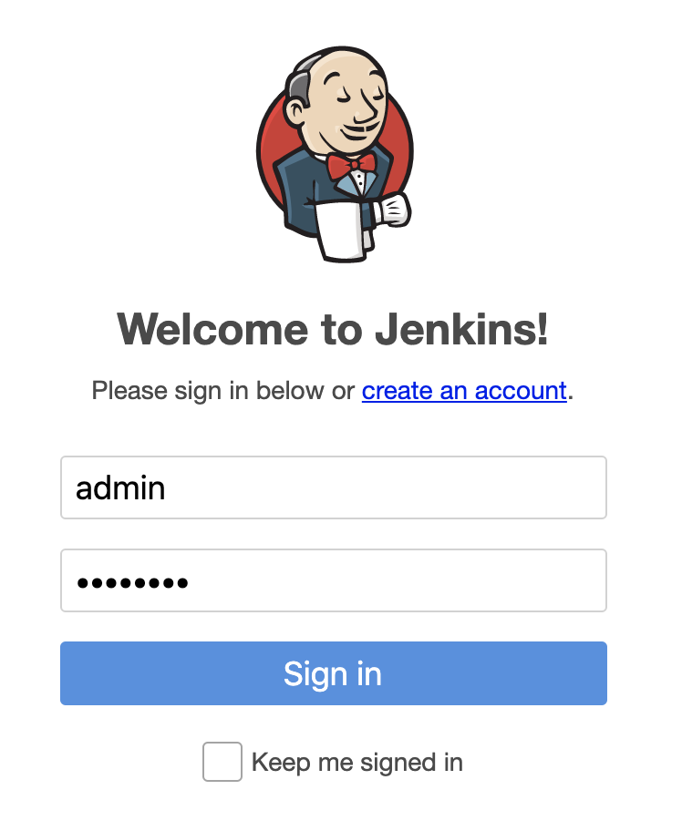

# Container Security with Jenkins and Aqua


- [Overview](#overview)
- [Hands On](#hands-on)
    - [Pre-check](#pre-check)
        - [Check Jenkins is running](#check-jenkins-is-running)
        - [Request for the microscanner Token](#request-for-the-microscanner-token)
        - [Setup](#setup)
    - [Building the Pipeline](#building-the-pipeline)
        - [Defining a freestyle microscanner job](#Defining-a-freestyle-microscanner-job)
        - [Defining a Pipeline script job](#Defining-a-Pipeline-script-job)
- [Conclusion](#conclusion)
- [Jenkins training](#jenkins-training)
- [Resources](#resources)
- [Appendix](#appendix)
    - [Setting up the Playground Environment](#setting-up-the-playground-environment)
    - [Tearing down the Playground Environment](#tearing-down-the-playground-environment)
    - [Pipeline Script](#Pipeline-Script)

# Overview

With the growing adoption of Containers comes a proportional concern for security. The Aqua Microscanner is a freely available tool that can check container images for vulnerabilities. With a Jenkins plugin available, the Aqua Microscanner can easily be integrated as part of an existing CI pipeline to integrate Container security as part of the pipeline process.

In this playground, we will be setting up a simple Jenkins job to build a docker image and scan it for vulnerabilities using the Aqua Microscanner plugin. We’ll then address the vulnerabilities before re-scanning the image.

# Hands-on

## Pre-check

### Check Jenkins is running

In a separate tab, navigate to http://\<IP\>:8080 and confirm Jenkins is up. You may need to login first (admin / password)


### Request for the Microscanner Token

Register for a token to use the OSS microscanner [here](https://microscanner.aquasec.com/signup)


### Setup

1. Login to Jenkins. By default, the credentials admin and password are available for use.

    

2. Click Manage Jenkins.

    

3. Click the Manage Plugins button.

    

4. Under Available, search for microscanner.

    

5. Check the install tickbox and click Download now and install after restart.

6. Once the plugins are installed, check the restart Jenkins tickbox and wait for Jenkins to restart.

    

7. Log back into Jenkins.

    

8. Click Manage Jenkins.

    

9. Click Configure System.

    

10. Under the Microscanner subsection, put in the token obtained from [registration](https://microscanner.aquasec.com/signup).

    

11. After clicking save, all Configurations are complete.

## Building the Pipeline
### Defining a freestyle microscanner job

1. Click New Item.

    

2. Select Freestyle Project and name it freestyle-microscanner.

    

3. Scroll down the project Configurations and under the Build subsection, select Aqua Microscanner.

    

4. Fill in the following:
    * Select Generate Report and FAIL the build
    * Type exit 1 for 'Execute shell command (optional)'
    * Select Output html report for the output format
    * Select jboss/wildfly:15.0.1.Final for the image to scan

    

5. After saving the project, click build now

    

6. Once the job is complete (a page refresh may be necessary), click the sphere for the console output. Note that the job is expected to fail.

    

7. Click the Image name beside the Aqua Microscanner symbol.

    

8. The results of the AquaMicroscanner are available across the tabs for viewing.

    

### Defining a Pipeline script job

1. Click New Item.

    

2. Select Pipeline Script and name it ci-pipeline-microscanner.

    

3. For the pipeline script, copy the pipeline script provided in the Appendix.

    

4. After saving, click build now.

    

5. Once again, it is expected for the job to fail. This time, instead of clicking the console output, you can try to access the artefacts from the small blue button beside the job number and click the scanout.html.

    

6. The report will show that the Alpine:3.3 Image has vulnerabilities and is non-compliant.

    

7. A quick fix for the image being non-compliant is to use the latest version of the alpine-image. Comment out the alpine:3.3 line and uncomment out alpine:latest.

    

8. Run the build again and this time the job should succeed. You may need to refresh the page to see he last successful artifacts. Click e scanout.html to view the microscanner results.

    

9. The report will show that the Alpine:latest image was compliant and why the rest of the pipeline could proceed.
 
    

# Conclusion

In this playground, we've shown how to scan an image from the Docker repository. In addition, we've also shown how to use integrate the Aqua Microscanner into an existing pipeline to scan images before they are used.

One way to further improve and build on this playground is to use Jenkins to build a Dockerfile placed in the SCM. The Aqua Microscanner can actually be integrated as part of the Dockerfile to run its scan when building the image. More details on this process can be found in their [repository](https://github.com/aquasecurity/microscanner).


# Jenkins Training

If you would like to further your knowledge with the Jenkins product suite. Consider booking a training course with one of ECS Digital certified Jenkins trainers.

For more information check out the link below:

https://ecs-digital.co.uk/what-we-do/training

# Resources
### Jenkins

Product Details
https://jenkins.io/

Documentation
https://jenkins.io/doc/


### Aqua
Product Details
https://www.aquasec.com

Microscanner Repository
https://github.com/aquasecurity/microscanner

Jenkins Microscanner plugin Repository
https://github.com/jenkinsci/aqua-microscanner-plugin

Kube-Hunter Repository
https://github.com/aquasecurity/kube-hunter

Kube-Bench Repository
https://github.com/aquasecurity/kube-bench

### Hashicorp Terraform

Product Details
https://www.terraform.io/

Documentation
https://www.terraform.io/docs/index.html


# Appendix

### Setting up the Playground Environment

Ensure you have the latest version of terraform installed.

Set the following environment variables:

```
$export AWS_ACCESS_KEY_ID=<YOUR KEY ID>
$export AWS_SECRET_ACCESS_KEY=<YOUR ACCESS KEY>
```

Navigate to the _setup directory and execute:

```
$terraform init
```

Then execute:
```
$terraform plan
```

Finally, apply the plan:

```
$terraform apply
```


### Tearing down the Playground Environment

Navigate to the _setup directory and execute:

```
$terraform destroy
```

### Pipeline Script

```
pipeline {
    agent any

environment {
        DOCKER_IMAGE = 'alpine:3.3'
        // DOCKER_IMAGE = 'alpine:latest'
    }

    stages {
        stage('Microscanner'){
            steps{
                aquaMicroscanner imageName: "$DOCKER_IMAGE", notCompliesCmd: 'exit 1', onDisallowed: 'fail', outputFormat: 'html'
            }
        }
        stage('checkout'){
            
            steps{
                echo 'Starting Jenkins checkout stage'
                echo 'Jenkins checkout stage complete'
            }
        }
        stage('build'){
            agent {
                docker {image "$DOCKER_IMAGE"}
            }
            steps{
                echo 'Starting Jenkins build stage' 
                echo 'Jenkins build stage complete'
            }
        }
        stage('test'){
            steps{
                echo 'Starting Jenkins test stage'
                echo 'Jenkins test stage complete'
            }
        }
        stage('deploy'){
            steps {
                echo 'Starting Jenkins deploy stage'
                echo 'Jenkins deploy stage complete'
            }
        }
    }

}
```